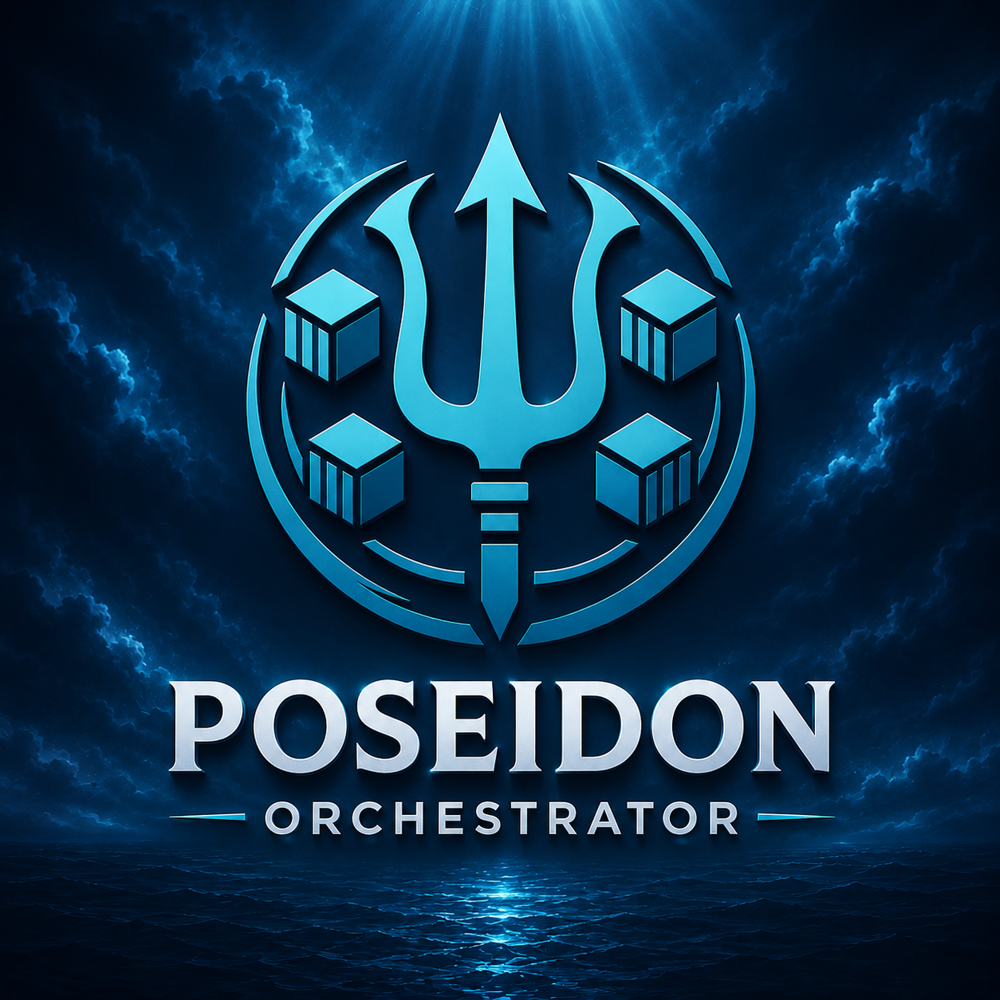

# Poseidon

Container Orchestrator from scratch

<div align="center">

</div>

Poseidon is a single-binary container orchestrator built in Go. It manages Docker containers across a cluster of worker nodes, with optional service discovery (VIP allocation, DNS, TCP proxy) and Raft-based high availability.

---

## Tech Stack

- **Language**: Go 1.26.4
- **CLI framework**: Cobra (`spf13/cobra`)
- **HTTP router**: chi (`go-chi/chi/v5`)
- **Containerization**: Docker SDK (`docker/docker` v20.10)
- **Consensus / KV store**: Zodiac + Raft (embedded)
- **Data Storage**: BoltDB (`boltdb/bolt`) or in-memory
- **DNS**: miekg/dns
- **Metrics**: goprocinfo (`/proc` on Linux)
- **Scheduling**: RoundRobin or E-PVM (energy-aware)

---

## Features

| Feature                                            | Status |
|----------------------------------------------------|--------|
| Start, stop, delete Docker containers              | ✔      |
| Task lifecycle (Pending → Scheduled → Running → Done/Failed) | ✔ |
| State transition validation                        | ✔      |
| Collect & expose worker metrics (CPU, memory, disk)| ✔      |
| Scheduler: RoundRobin and E-PVM placement          | ✔      |
| Manager control loop                               | ✔      |
| Worker API + Manager API                           | ✔      |
| Persistent storage (BoltDB)                        | ✔      |
| Task health checks & auto-restart (max 3 retries)  | ✔      |
| Service Discovery: VIP pool, DNS, TCP proxy        | ✔      |
| High availability (Raft-based replicated manager)  | ✔      |
| Self-hosting agent (static pod manifests)          | ✔      |
| CLI interface                                      | ✔      |

---

## Architecture

```
main.go → cmd/ (Cobra subcommands)
  ├── manager/    — control loops (ProcessTasks, UpdateTasks, DoHealthChecks),
  │                 scheduling, task-worker mapping, VIP allocation, registry sync
  ├── worker/     — Docker container lifecycle, /proc stats collection
  ├── task/       — Task/TaskEvent types, Docker SDK wrapper, state machine
  ├── scheduler/  — RoundRobin or E-PVM placement algorithm
  ├── store/      — Store interface; in-memory, BoltDB, or Raft-backed (Zodiac)
  ├── node/       — worker node representation (Manager-side stats collection)
  ├── stats/      — Linux /proc/meminfo, /proc/stat, /proc/loadavg (goprocinfo)
  ├── utils/      — HTTP retry helper
  ├── dns/        — embedded UDP DNS server (miekg/dns), resolves
  │                 <name>.svc.poseidon.cluster (A, SRV, PTR)
  ├── network/    — VIP pool — atomic sequential IP allocation from a CIDR via
  │                 Zodiac transactions
  ├── proxy/      — userspace TCP proxy, watches registry, listens on VIP:port,
  │                 forwards to worker host
  ├── registry/   — Zodiac-backed service registry with health awareness
  ├── system/     — self-hosting agent + Docker manifest reconciler
  └── cmd/        — CLI entrypoints: manager, worker, agent, node, run,
                    status, stop
```

### Component relationships

```
┌──────────┐     ┌──────────┐     ┌──────────┐
│   CLI    │────▶│ Manager  │────▶│  Worker  │────▶ Docker
│ (cobra)  │     │ (chi)    │     │ (chi)    │
└──────────┘     └────┬─────┘     └──────────┘
                      │
              ┌───────┴────────┐
              │  Zodiac KV     │
              │  (Raft cluster)│
              └───────┬────────┘
                      │
         ┌────────────┼────────────┐
         ▼            ▼            ▼
      Registry     VIP Pool      Mappings
    (services)   (allocations)  (task→worker)
         │
    ┌────┴────┐
    ▼         ▼
   DNS      Proxy
 (miekg)   (TCP fwd)
```

---

## How It Works

### Task state machine

```
Pending → Scheduled → Running → Completed
                            ↘  Failed
```

Transitions are validated by `task.ValidStateTransition()`. Invalid transitions are silently rejected.

1. **Pending** — a task is submitted via the API or CLI. It lands in the pending queue (`/poseidon/tasks/pending/` in Zodiac KV).
2. **Scheduled** — the manager's scheduler picks a worker (RoundRobin or E-PVM) and assigns the task.
3. **Running** — the worker starts a Docker container and monitors it.
4. **Completed** — the container exits successfully, or the user stops the task.
5. **Failed** — the container fails; the manager will auto-restart up to 3 times.

### Manager control loops

The manager runs three concurrent loops, each only on the Raft leader:

| Loop | Interval | Purpose |
|------|----------|---------|
| `ProcessTasks` | 10s | Pull tasks from the pending queue, select a worker, allocate a VIP if needed, dispatch to worker |
| `UpdateTasks` | 15s | Poll all workers for task state changes, sync registry on transitions |
| `DoHealthChecks` | 60s | HTTP health check on running tasks; restart unhealthy tasks (max 3) |

### Scheduling algorithms

- **RoundRobin** — cycles through workers in order.
- **E-PVM** — Energy-aware Preferential VM placement using the LIEB square ice constant. Scores workers based on CPU load, memory allocation, and task count, picking the lowest-cost candidate.

### Storage backends

| Backend | Type | Persistence |
|---------|------|-------------|
| `memory` | In-memory maps | None |
| `persistent` | BoltDB files (`*.db`) | Local file |
| `raft` | Zodiac KV (Raft consensus) | Distributed, survives leader changes |

---

## Quick Start

### Prerequisites

- Linux (reads `/proc` filesystem)
- Docker daemon running (`DOCKER_HOST` or default socket)
- Go 1.26+

### Traditional mode (manager + worker)

```bash
# Terminal 1: start a worker
go run main.go worker --port 5556 --name worker-1

# Terminal 2: start a manager, pointing at the worker
go run main.go manager --port 5555 --workers localhost:5556 --scheduler epvm

# Terminal 3: submit a task
go run main.go run --filename data/task1.json

# List tasks, stop a task, list nodes
go run main.go status
go run main.go stop <uuid>
go run main.go node
```

### Raft mode (replicated manager + service discovery)

```bash
# Terminal 1: Worker
go run main.go worker --port 5556 --name worker-1

# Terminal 2: First manager (bootstraps the Raft cluster)
go run main.go manager \
  --dbType raft --node-id 1 --raft-port 9001 \
  --data-dir /tmp/poseidon/m1 \
  --workers localhost:5556 \
  --scheduler epvm \
  --service-cidr 10.42.0.0/16

# Terminal 3: Second manager (joins the cluster)
go run main.go manager \
  --dbType raft --node-id 2 --raft-port 9002 \
  --data-dir /tmp/poseidon/m2 \
  --raft-join localhost:9001 \
  --workers localhost:5556

# Terminal 4: Start a proxy+DNS node
go run main.go node --raft localhost:9001 --dns-addr 0.0.0.0:5353
```

### Self-hosting mode

```bash
# Build system container images
docker build -t poseidon-worker:latest -f Dockerfile.worker .
docker build -t poseidon-proxy:latest -f Dockerfile.proxy .
docker build -t poseidon-dns:latest -f Dockerfile.dns .

# Copy manifests and start the agent
mkdir -p /tmp/poseidon/manifests
cp manifests/*.json /tmp/poseidon/manifests/

go run main.go agent \
  --node-id 1 --raft-port 9001 \
  --data-dir /tmp/poseidon/agent \
  --manifest-dir /tmp/poseidon/manifests \
  --interval 10s
```

### run.sh helper

```bash
# Traditional mode (manager + worker with Raft and service discovery)
./run.sh traditional

# Self-hosted mode (builds Docker images, starts agent)
./run.sh self-hosted
```

---

## CLI Reference

### Global flags

| Flag | Default | Description |
|------|---------|-------------|
| `--manager` / `-m` | `localhost:5555` | Manager address for `run`, `status`, `stop` commands |

### Subcommands

#### `manager`

Start a manager node.

| Flag | Default | Description |
|------|---------|-------------|
| `--port` / `-p` | `5555` | API listen port |
| `--host` / `-H` | `0.0.0.0` | API listen address |
| `--workers` / `-w` | `localhost:5556` | Comma-separated worker addresses |
| `--scheduler` / `-s` | `epvm` | Scheduler: `epvm` or `roundrobin` |
| `--dbType` / `-d` | `memory` | Store type: `memory`, `persistent`, or `raft` |
| `--node-id` | `0` | Raft node ID (required for raft mode) |
| `--raft-port` | `9001` | Zodiac KV HTTP API port |
| `--data-dir` | `/tmp/poseidon` | Raft log/snapshot directory |
| `--raft-join` | | Comma-separated Zodiac HTTP addresses to join |
| `--service-cidr` | | CIDR for VIP pool (e.g. `10.42.0.0/16`) |

#### `worker`

Start a worker node.

| Flag | Default | Description |
|------|---------|-------------|
| `--port` / `-p` | `5556` | API listen port |
| `--host` / `-H` | `0.0.0.0` | API listen address |
| `--name` / `-n` | `worker-<uuid>` | Worker name |
| `--dbtype` / `-d` | `memory` | Store type: `memory` or `persistent` |

#### `agent`

Start a self-hosting agent (reads manifests, ensures system containers run).

| Flag | Default | Description |
|------|---------|-------------|
| `--node-id` | `1` | Raft node ID |
| `--raft-port` | `9001` | Zodiac KV HTTP API port |
| `--data-dir` | `/tmp/poseidon/agent` | Raft log directory |
| `--raft-join` | | Comma-separated Zodiac addresses to join |
| `--manifest-dir` / `-m` | `/etc/poseidon/manifests` | Directory of JSON manifests |
| `--interval` / `-i` | `10s` | Reconciliation interval |

#### `node`

Start a proxy + DNS node for service discovery.

| Flag | Default | Description |
|------|---------|-------------|
| `--raft` / `-r` | `localhost:9001` | Zodiac KV HTTP addresses |
| `--listen-addr` / `-l` | `0.0.0.0` | Proxy listen address |
| `--dns-addr` | `0.0.0.0:53` | DNS listen address (UDP) |

#### `run`

Submit a task from a JSON file.

| Flag | Default | Description |
|------|---------|-------------|
| `--filename` / `-f` | `./data/task1.json` | Task JSON file |
| `--manager` / `-m` | `localhost:5555` | Manager address |

#### `status`

List all tasks from the manager.

| Flag | Default | Description |
|------|---------|-------------|
| `--manager` / `-m` | `localhost:5555` | Manager address |

#### `stop <uuid>`

Stop a running task.

| Flag | Default | Description |
|------|---------|-------------|
| `--manager` / `-m` | `localhost:5555` | Manager address |

---

## API Reference

### Manager API (`:5555`)

| Method | Route | Description |
|--------|-------|-------------|
| `GET` | `/tasks` | List all tasks |
| `POST` | `/tasks` | Submit a new task (JSON body is a `TaskEvent`) |
| `DELETE` | `/tasks/{taskID}` | Stop a task |
| `GET` | `/nodes` | List registered worker nodes |
| `GET` | `/status` | Returns `{"isLeader": bool, "taskCount": int}` |

### Worker API (`:5556`)

| Method | Route | Description |
|--------|-------|-------------|
| `GET` | `/tasks` | List all tasks on this worker |
| `POST` | `/tasks` | Start a task on this worker |
| `DELETE` | `/tasks/{taskID}` | Stop a task on this worker |
| `GET` | `/stats` | Get worker metrics (CPU, memory, disk) |

### Task JSON format

Task files use a `TaskEvent` envelope wrapping a `Task`. See `data/task*.json` for examples:

```json
{
    "ID": "event-uuid",
    "State": 2,
    "Task": {
        "State": 1,
        "ID": "task-uuid",
        "Name": "my-task",
        "Image": "strm/helloworld-http"
    }
}
```

State values: `0`=Pending, `1`=Scheduled, `2`=Running, `3`=Completed, `4`=Failed.

---

## Service Discovery

Service discovery requires `--dbType raft` and `--service-cidr` on the manager.

### VIP Pool (`network/`)

Atomic sequential IP allocation from a CIDR (e.g. `10.42.0.0/16`). Uses Zodiac transactions for consistency. Index `0` is reserved for the network address, index `1` is the first allocatable IP.

### Registry (`registry/`)

Zodiac-backed service registry. The manager auto-registers tasks when they reach `Running` state (allocating a VIP) and deregisters on `Completed`/`Failed`. Each instance stores its name, VIP, ports, worker, and health status.

### DNS (`dns/`)

Embedded UDP DNS server using `miekg/dns`. Resolves `<name>.svc.poseidon.cluster`:

- **A records** — returns the VIP(s) for healthy instances
- **SRV records** — returns port and hostname for healthy instances
- **PTR records** — reverse lookup from VIP to service name

Results are cached for 30 seconds.

### Proxy (`proxy/`)

Userspace TCP proxy that watches the registry and listens on `VIP:port` for each healthy service instance. Forwards incoming connections to the worker host's corresponding port. On Linux, adds the VIP to the loopback interface (`lo`).

### Self-hosting agent (`system/`)

The `agent` command reads JSON manifests from a directory (like Kubernetes static pods) and ensures the defined Docker containers are always running. Manifests are sorted by filename and reconciled on a configurable interval.

Pre-built manifests in `manifests/`:

| File | Container | Purpose |
|------|-----------|---------|
| `01-worker.json` | `poseidon-worker` | Worker node |
| `02-proxy.json` | `poseidon-proxy` | TCP proxy |
| `03-dns.json` | `poseidon-dns` | DNS server |

---

## Raft Mode (Replicated Manager)

Each manager embeds a Zodiac Raft KV node. Only the leader runs scheduling/health-check control loops; all replicas accept API writes which land in the shared KV store.

Key prefixes stored in Zodiac:

| Prefix | Content |
|--------|---------|
| `/poseidon/tasks/` | Task definitions |
| `/poseidon/events/` | Task events |
| `/poseidon/tasks/pending/` | Pending tasks (only leader processes) |
| `/poseidon/mappings/task-worker/` | Task-to-worker assignments (survives leader changes) |
| `/poseidon/vips/next` | Next VIP index |
| `/poseidon/vips/allocations/` | VIP-to-task mappings |
| `/poseidon/vips/ips/` | Task-to-VIP mappings |
| `/poseidon/registry/services/` | Service registry entries |
| `/poseidon/registry/instances/` | Instance-to-service index |

### Joining a cluster

```bash
# Start a second manager that joins the cluster bootstrapped above
go run main.go manager \
  --dbType raft --node-id 2 --raft-port 9002 \
  --data-dir /tmp/poseidon/m2 \
  --raft-join localhost:9001 \
  --workers localhost:5556
```

The `--raft-join` flag takes one or more Zodiac HTTP addresses of existing cluster members. The joining node finds the leader and sends a join request.

---

## Testing

```bash
# Run all tests
go test ./...

# Run package-level tests only (network, registry — use embedded Zodiac)
go test ./network/ ./registry/

# Run e2e tests (require embedded Zodiac, no Docker daemon needed)
go test -run TestE2E -v .
```

Unit tests for `network/` and `registry/` use an embedded 3-node Zodiac test harness — no external dependencies. The e2e test at the root level exercises full task round-trips, leader failover, VIP pool allocation, DNS resolution, and registry service discovery.

---

## Task Manifest Examples

### User task (`data/task1.json`)

Simple HTTP server task submitted via the CLI:

```json
{
    "ID": "6be4cb6b-61d1-40cb-bc7b-9cacefefa60c",
    "State": 2,
    "Task": {
        "State": 1,
        "ID": "21b23589-5d2d-4731-b5c9-a97e9832d021",
        "Name": "test-chapter-5",
        "Image": "strm/helloworld-http"
    }
}
```

### System manifest (`manifests/01-worker.json`)

Agent-managed system container (like a static pod):

```json
{
    "name": "poseidon-worker",
    "image": "poseidon-worker:latest",
    "restartPolicy": "always",
    "ports": [
        { "containerPort": 5556, "protocol": "tcp" }
    ],
    "env": {
        "POSEIDON_WORKER_PORT": "5556",
        "POSEIDON_WORKER_DBTYPE": "memory"
    },
    "cpus": 0.25,
    "memory": 134217728
}
```
