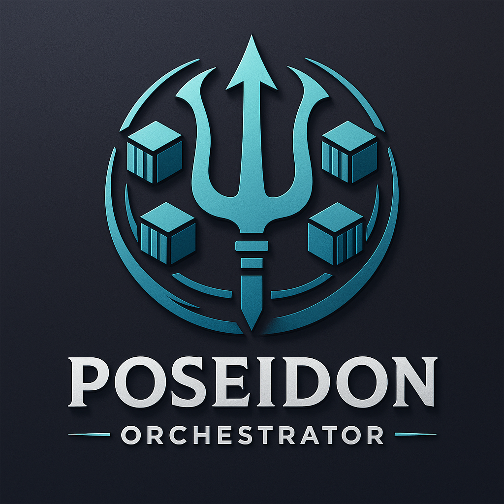

# Poseidon
Container Orchestrator from scratch

### Tech Stack
- **Language**: `Go`
- **Containerization**: `Docker Go SDK`
- **Networking**: `chi`
- **Data Storage**: `BoltDB`
- **Metrics**: `goprocinfo`
  

### Core Components
1) **Task**: the smallest unit of work, specifies a container image to run, resource requirements and a restart policy. 
2) **Scheduler**: responsible for placing tasks on nodes based on resource availability and task requirements, computes a score for each node. 
3) **Manager**: accepts tasks submissions, collects metrics from workers, keeps track of tasks, their states, and the machine on which they run.
4) **Worker**: executes tasks assigned by the manager, reports status and metrics back to the manager.
5) **CLI**: command-line interface for users to interact with the orchestrator, submit tasks, and check status.
  

### What's missing
- High availability
- Load balancing
- Security

